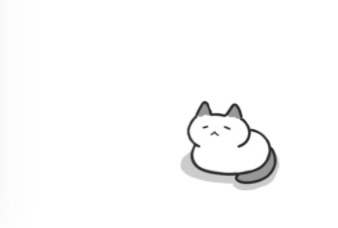

# web-pet



[](https://www.npmjs.com/package/web-pet)

在页面上打瞌睡的一只小猫咪，偶尔会唠唠嗑和用户聊天。负责陪伴和引导用户。

~~但它的实际作用是记录用户行为和设备页面性能信息，并上报每次的统计信息。~~

简体中文 | [English](./README-EN.md)

## 启动
```
npm run dev
```

## 构建生产
```
npm run build
```

## 安装

使用 npm:

```bash
npm install web-pet
```

使用script标签:

```html
<script src="/dist/webPet.min.js"></script>
```
## 例子

```js
import WebPet from "web-pet";

const firstPet = new WebPet();

const opt = {
  ...
}

const otherPet = new WebPet(opt);
```

## WebPet 配置
你可以个性化配置生成自定义属性的宠物。
```js
{
  name: '二狗',
  footPrint: false,
  report: true,
  reportUrl: "http://localhost:3000/api/report",
  action: {
    firstGreet: false,
    randomMove: true,
    randomSay: true
  },
  server: {
    answer: {
      url: "http://localhost:3000/api/answer",
      dataPath: "data.msg",
      separator: "."
    }
  },
  on: {
    create: function(){ },
    mounted: function(){ }
  }
  ...
}
```

## License

MIT
